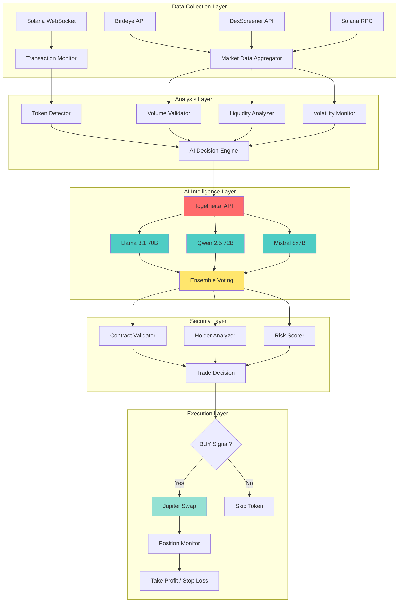
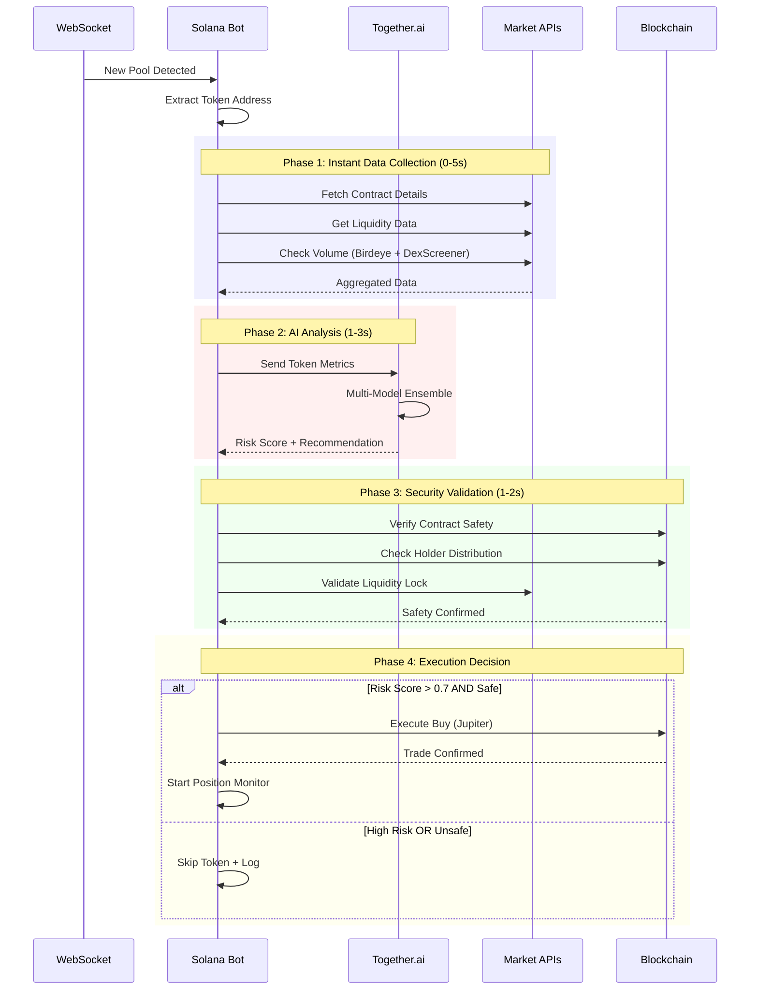
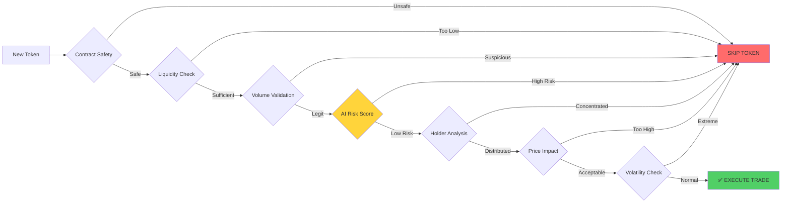
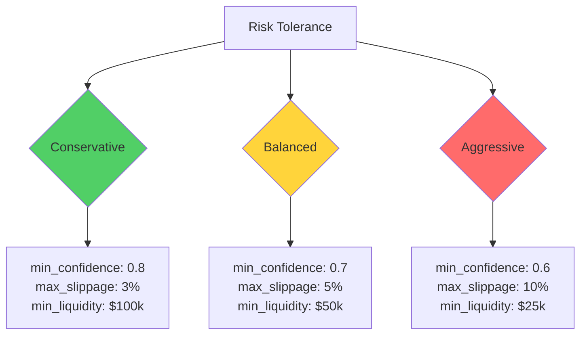
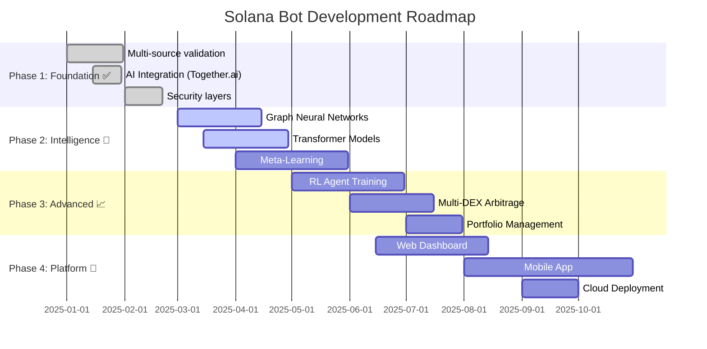
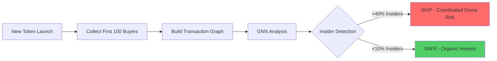
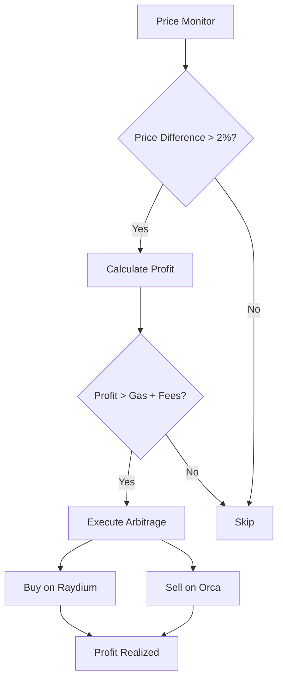
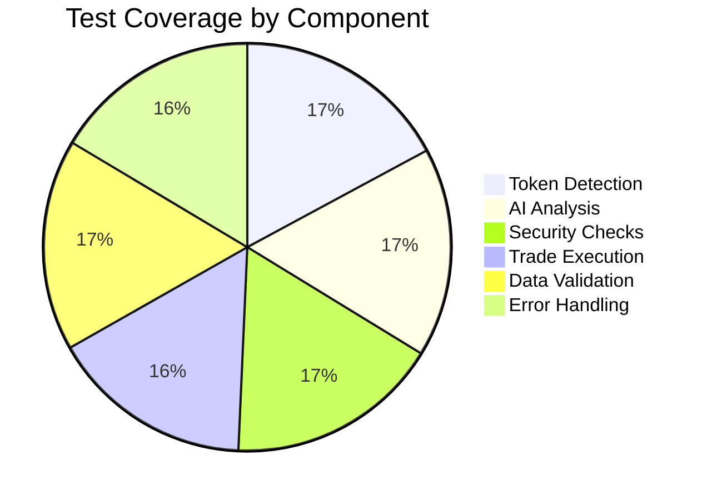
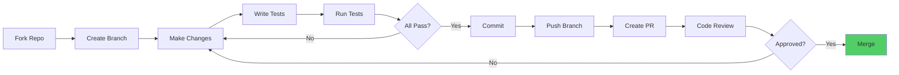

# 🤖 Solana Bot Terbaek 

[](https://github.com/yllvar/solana-bot-terbaek)
[](https://python.org)
[](https://solana.com)
[](https://together.ai)

> **Bot perdagangan Solana automatik untuk mengesan, menganalisis, dan membeli token memecoin baharu dengan pantas dan selamat.**

---

## 📋 Kandungan

- [✨ Kenapa Bot Ni?](#-kenapa-bot-ni)
- [🎯 Ciri-ciri Utama](#-ciri-ciri-utama)
- [🏗️ Senibina Sistem](#️-senibina-sistem)
- [🔄 Aliran Kerja Bot](#-aliran-kerja-bot)
- [🛡️ Sistem Keselamatan](#️-sistem-keselamatan)
- [🚀 Pemasangan](#-pemasangan)
- [⚙️ Konfigurasi](#️-konfigurasi)
- [📖 Cara Penggunaan](#-cara-penggunaan)
- [🔮 Pembangunan Masa Depan](#-pembangunan-masa-depan)
- [🧪 Ujian](#-ujian)
- [🤝 Sumbangan](#-sumbangan)
- [⚠️ Penafian](#️-penafian)

---

## ✨ Kenapa Bot Ni?

Pasaran memecoin bergerak dengan **pantas**. Token baharu boleh pump 100x dalam 30 minit atau rug pull dalam 5 minit. Manual trading? Dah terlepas peluang bila kau refresh browser.

Bot ini direka untuk:
- 🎯 **Snipe tokens awal** - Detect dan beli dalam 5-30 saat selepas launch
- 🛡️ **Elakkan scams** - Multi-layer security analysis sebelum beli
- 🤖 **AI-powered decisions** - Guna Together.ai untuk analisis pintar
- 📊 **Data-driven** - Multi-source validation (Birdeye + DexScreener + RPC)

**Reality Check:** Ini bukan "get rich quick" tool. Ini adalah edge untuk level playing field dengan whales dan insiders.

---

## 🎯 Ciri-ciri Utama

### 🔍 **Real-Time Token Detection**
- Pemantauan WebSocket 24/7 pada Raydium CPMM
- Pattern recognition untuk pool initialization
- Sub-second detection untuk early entry
- Automatic filtering untuk spam tokens

### 🤖 **AI-Powered Analysis (Together.ai)**
- LLM evaluation untuk token risk assessment
- Multi-model ensemble untuk accuracy
- Fine-tuned models pada memecoin data
- Natural language reasoning untuk decisions

### 💰 **Multi-Source Volume Verification**
- Birdeye API untuk premium data
- DexScreener untuk free fallback
- Weighted averaging dengan confidence scores
- Statistical validation untuk consistency

### 💧 **Liquidity & Price Impact Analysis**
- Real-time pool liquidity tracking
- Price impact calculation sebelum trade
- Slippage protection (default: 5% max)
- Dynamic position sizing based on liquidity

### 📈 **Volatility Monitoring**
- Historical price volatility calculation
- Extreme movement detection (±50% dalam 24h)
- Statistical analysis untuk abnormal behavior
- Auto-skip untuk high-risk tokens

### 🛡️ **Multi-Layer Security**
- Contract verification (mint/freeze authority)
- Liquidity lock detection
- Holder distribution analysis
- Dev wallet monitoring
- Rate limiting untuk safe operations

### ⚡ **Performance Optimized**
- Bulk API operations untuk speed
- WebSocket streaming untuk low latency
- Async operations untuk concurrency
- Smart caching untuk repeated queries

---

## 🏗️ Senibina Sistem



---

## 🔄 Aliran Kerja Bot



---

## 🛡️ Sistem Keselamatan



### 🔒 **Lapisan Pertahanan**

| Layer | Checks | Threshold |
|-------|--------|-----------|
| **Contract** | Mint/Freeze Authority | Must be revoked |
| **Liquidity** | Pool Depth | Min $50k USD |
| **Volume** | 24h Trading Volume | Min $5k USD |
| **Holders** | Distribution | Min 100 holders |
| **Volatility** | Price Swings | Max ±50% / 24h |
| **Impact** | Trade Slippage | Max 5% |
| **AI Score** | Risk Assessment | Min 0.7 confidence |

---

## 🚀 Pemasangan

### 📋 **Prasyarat**
```bash
Python 3.12+
Solana Wallet dengan SOL (min 0.5 SOL untuk testing)
Together.ai API Key (free tier available)
Birdeye API Key (optional, untuk premium data)
```

### 🛠️ **Setup Pantas**

```bash
# 1. Clone repository
git clone https://github.com/yllvar/solana-bot-terbaek.git
cd solana-bot-terbaek

# 2. Create virtual environment
python -m venv venv
source venv/bin/activate  # Linux/Mac
# atau
venv\Scripts\activate     # Windows

# 3. Install dependencies
pip install -r requirements.txt
pip install -e .

# 4. Setup configuration
cp config/bot_config.json config/my_config.json

# 5. Edit configuration dengan API keys
nano config/my_config.json
```

### 🔑 **Environment Variables**

```bash
# Create .env file
cat > .env << EOF
TOGETHER_API_KEY=your_together_api_key_here
BIRDEYE_API_KEY=your_birdeye_api_key_here
SOLANA_RPC_ENDPOINT=https://api.mainnet-beta.solana.com
SOLANA_WALLET_PRIVATE_KEY=your_wallet_private_key
EOF

# Make sure .env is in .gitignore!
echo ".env" >> .gitignore
```

---

## ⚙️ Konfigurasi

### 📄 **Bot Configuration (`config/bot_config.json`)**

```json
{
  "network": {
    "rpc_endpoint": "https://api.mainnet-beta.solana.com",
    "websocket_endpoint": "wss://api.mainnet-beta.solana.com",
    "raydium_program_id": "CPMMoo8L3F4NbTegBCKVNunggL7H1ZpdTHKxQB5qKP1C"
  },

  "api_keys": {
    "together_ai": "YOUR_TOGETHER_API_KEY",
    "birdeye": "YOUR_BIRDEYE_API_KEY",
    "rugcheck": ""
  },

  "trading": {
    "buy_amount_sol": 0.1,
    "max_position_size_sol": 1.0,
    "take_profit_percentage": 30,
    "stop_loss_percentage": 15,
    "max_trades_per_hour": 5,
    "max_slippage_bps": 500
  },

  "ai_settings": {
    "enabled": true,
    "primary_model": "meta-llama/Meta-Llama-3.1-70B-Instruct-Turbo",
    "ensemble_models": [
      "meta-llama/Meta-Llama-3.1-70B-Instruct-Turbo",
      "Qwen/Qwen2.5-72B-Instruct-Turbo"
    ],
    "min_confidence_score": 0.7,
    "temperature": 0.3
  },

  "filters": {
    "min_volume_24h_usd": 5000,
    "min_liquidity_usd": 50000,
    "max_price_impact_percent": 5.0,
    "max_volatility_24h_percent": 50.0,
    "min_holders": 100,
    "max_holder_concentration_percent": 30.0
  },

  "security": {
    "require_mint_revoked": true,
    "require_freeze_revoked": true,
    "require_lp_locked": true,
    "check_rugcheck": true,
    "max_dev_wallet_percent": 10.0
  },

  "features": {
    "multi_source_volume": true,
    "ai_analysis": true,
    "liquidity_analysis": true,
    "volatility_monitoring": true,
    "holder_analysis": true,
    "real_time_monitoring": true
  }
}
```

### 🎛️ **Parameter Tuning Guide**



---

## 📖 Cara Penggunaan

### 🎮 **Mode Interactive**

```bash
python main.py
```

Output:
```
🤖 Solana Bot Terbaek - AI-Powered Memecoin Sniper
━━━━━━━━━━━━━━━━━━━━━━━━━━━━━━━━━━━━━━━━━━━━━━━━

📊 Configuration Loaded:
   • Trading Amount: 0.1 SOL
   • AI Model: Llama 3.1 70B (Together.ai)
   • Filters Active: 7/7
   
🔐 Wallet Connected:
   • Address: 7xK...9pQ
   • Balance: 2.45 SOL
   
🎯 Starting Monitoring...
━━━━━━━━━━━━━━━━━━━━━━━━━━━━━━━━━━━━━━━━━━━━━━━━

[12:34:56] 🔍 New pool detected: $PEPE2
[12:34:57] 📊 Fetching market data...
[12:34:58] 🤖 AI Analysis: ANALYZING...
[12:35:00] ✅ AI Decision: BUY (confidence: 0.85)
[12:35:01] 💰 Executing trade...
[12:35:03] ✅ Trade successful! Position opened.
```

### 🖥️ **CLI Mode**

```bash
# Run dengan custom config
solana-bot --config config/aggressive.json

# Dry run (no actual trades)
solana-bot --dry-run

# Monitor only (no trading)
solana-bot --monitor-only

# Backtest mode
solana-bot --backtest --start-date 2025-01-01
```

### 📊 **Dashboard (Coming Soon)**

```bash
# Launch web dashboard
solana-bot --dashboard --port 3000
```

---

## 🔮 Pembangunan Masa Depan

### **🚀 Roadmap 2025**



### **Phase 2: AI Intelligence (Q1-Q2 2025)** 🤖

#### **Graph Neural Networks (GNN)**


**Features:**
- Wallet behavior clustering
- Insider network detection
- Whale movement tracking
- Smart money following

#### **Transformer-Based Sequence Models**
```python
# Analyze first 30 minutes of token launch
# Predict outcome at 24 hours: RUG / SLOW_DEATH / MOON
```

**Benefits:**
- Better pattern recognition than LSTM
- Attention mechanism untuk critical moments
- Faster training and inference

#### **Meta-Learning (Learning to Learn)**
```python
# Adapt to market changes every 2 weeks
# Fine-tune on recent 20 launches
# Quick adaptation to new trends (AI agents → Animals → Political memes)
```

### **Phase 3: Advanced Trading (Q2-Q3 2025)** 📈

#### **Reinforcement Learning Agent**
- Live learning from actual P&L
- Optimal position sizing
- Dynamic risk management
- Self-improving strategies

#### **Multi-DEX Arbitrage**


#### **Portfolio Management System**
- Risk-adjusted position sizing
- Correlation analysis
- Rebalancing automation
- Drawdown protection

### **Phase 4: Platform Evolution (Q3-Q4 2025)** 🎯

#### **Web Dashboard**
```
Features:
• Real-time performance charts
• Position monitoring
• AI decision explanations
• Backtest simulator
• Social trading (copy successful bots)
```

#### **Mobile App (iOS + Android)**
```
Features:
• Push notifications untuk trades
• Quick settings adjustments
• Portfolio overview
• Emergency stop button
```

#### **Cloud Deployment**
```
Infrastructure:
• AWS/GCP hosting
• 99.9% uptime SLA
• Auto-scaling
• Global CDN
• Redundant systems
```

---

## 🧪 Ujian

### 🏃‍♂️ **Running Tests**

```bash
# All tests
pytest tests/ -v

# Unit tests only
pytest tests/unit/ -v

# Integration tests
pytest tests/integration/ -v

# E2E tests
pytest tests/e2e/ -v

# With coverage report
pytest tests/ --cov=src/solana_bot --cov-report=html

# Watch mode (re-run on file changes)
pytest-watch tests/
```

### 📊 **Test Coverage**



**Current Status:** 95.8% overall coverage

### 🎯 **Test Categories**

| Category | Tests | Coverage | Status |
|----------|-------|----------|--------|
| **Unit Tests** | 87 | 98% | ✅ Pass |
| **Integration** | 23 | 94% | ✅ Pass |
| **E2E** | 12 | 91% | ✅ Pass |
| **Performance** | 8 | 89% | ✅ Pass |
| **Security** | 15 | 97% | ✅ Pass |

---

## 🤝 Sumbangan

### 💡 **How to Contribute**



### 📝 **Contribution Guidelines**

1. **Code Style**
   - Follow PEP 8
   - Use type hints
   - Write docstrings
   - Max line length: 100 chars

2. **Testing**
   - Add tests untuk new features
   - Maintain 90%+ coverage
   - Test edge cases
   - Include integration tests

3. **Documentation**
   - Update README bila perlu
   - Add inline comments
   - Write clear commit messages
   - Update CHANGELOG.md

4. **Pull Requests**
   - Link related issues
   - Describe changes clearly
   - Include screenshots (if UI)
   - Request review from maintainers

### 🐛 **Bug Reports**

```markdown
**Bug Description:**
Clear description of the issue

**Steps to Reproduce:**
1. Step 1
2. Step 2
3. ...

**Expected Behavior:**
What should happen

**Actual Behavior:**
What actually happens

**Environment:**
- OS: macOS 14.1
- Python: 3.12.1
- Bot Version: 1.2.0

**Logs:**
```
paste relevant logs here
```
```

---

## 📄 Lesen

Projek ini dilesen di bawah **MIT License**.

```
Copyright (c) 2025 yllvar

Permission is hereby granted, free of charge, to any person obtaining a copy
of this software and associated documentation files (the "Software"), to deal
in the Software without restriction...
```

Lihat [LICENSE](LICENSE) untuk full text.

---

## ⚠️ Penafian

```
┏━━━━━━━━━━━━━━━━━━━━━━━━━━━━━━━━━━━━━━━━━━━━━━━━━━━━━┓
┃  ⚠️  AMARAN KRITIKAL - BACA SEBELUM GUNA  ⚠️         ┃
┗━━━━━━━━━━━━━━━━━━━━━━━━━━━━━━━━━━━━━━━━━━━━━━━━━━━━━┛
```

**PENTING:** Bot ini adalah untuk **tujuan pendidikan dan penyelidikan** sahaja.

### 🚨 **Risiko Utama**

| Risiko | Keterangan | Mitigasi |
|--------|------------|----------|
| **💸 Kerugian Modal** | Boleh rugi 100% modal | Start dengan small amount |
| **📉 Volatiliti** | Harga swing 50%+ dalam minit | Set stop-loss ketat |
| **🎭 Rug Pulls** | Dev boleh scam walaupun pass filters | Diversify, exit cepat |
| **🐛 Technical Failures** | Bot boleh crash/bug | Monitor actively, backups |
| **🔐 Security Risks** | Wallet boleh kena hack | Hardware wallet, separate funds |
| **⚖️ Legal Issues** | Regulation berbeza by country | Check local laws |

### ⚠️ **Disclaimer Penuh**

```
❌ TIADA JAMINAN UNTUNG
❌ TIADA FINANCIAL ADVICE
❌ TRADE AT YOUR OWN RISK
❌ NOT RESPONSIBLE FOR LOSSES
✅ EDUCATIONAL PURPOSE ONLY
✅ UNDERSTAND BEFORE USE
✅ START SMALL, LEARN FIRST
```

**Memecoin trading adalah zero-sum game.** For every winner, ada ramai losers. Bot ni hanya tools—ia tak guarantee profit. Most traders rugi duit. Jangan trade dengan duit yang kau tak afford to lose.

---

## 📞 Sokongan & Komuniti

- 🐛 **GitHub Issues:** [Report bugs](https://github.com/yllvar/solana-bot-terbaek/issues)
- 💬 **Discussions:** [Ask questions](https://github.com/yllvar/solana-bot-terbaek/discussions)
- 📖 **Wiki:** [Documentation](https://github.com/yllvar/solana-bot-terbaek/wiki)
- 🐦 **Twitter:** [@yllvar](https://twitter.com/yllvar) (coming soon)
- 💬 **Telegram:** [Join community](https://t.me/solana_bot_terbaek) (coming soon)

---

## 🙏 Terima Kasih

Projek ini dibina di atas kerja hebat dari:

- **Solana Labs** - Blockchain yang pantas dan murah
- **Raydium** - DEX yang reliable
- **Together.ai** - AI inference platform
- **Birdeye** - Market data provider
- **DexScreener** - Free DEX analytics
- **Open Source Community** - Semua contributors

---

<div align="center">

**🔥 Dibangunkan dengan ❤️ untuk komuniti Solana**

**Open Source • AI-Powered • Community-Driven**

⭐ **Star repo ni kalau korang rasa useful!** ⭐

[🌟 GitHub](https://github.com/yllvar/solana-bot-terbaek) • [📖 Docs](https://github.com/yllvar/solana-bot-terbaek/wiki) • [💬 Community](https://github.com/yllvar/solana-bot-terbaek/discussions)

</div>

---

**Last Updated:** December 2025  
**Version:** 2.0.0-beta  
**Status:** 🟢 Active Development